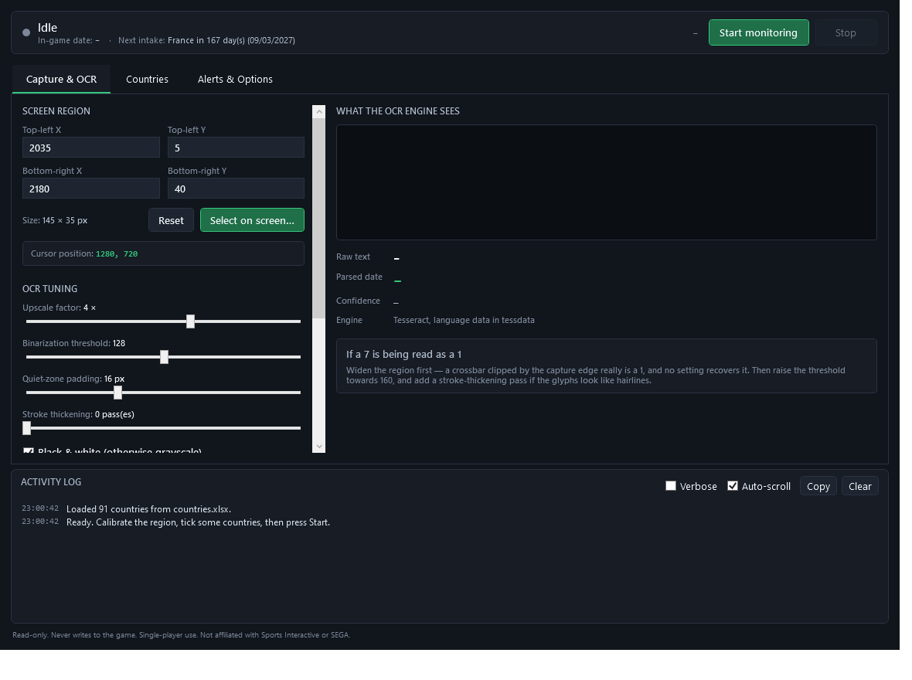
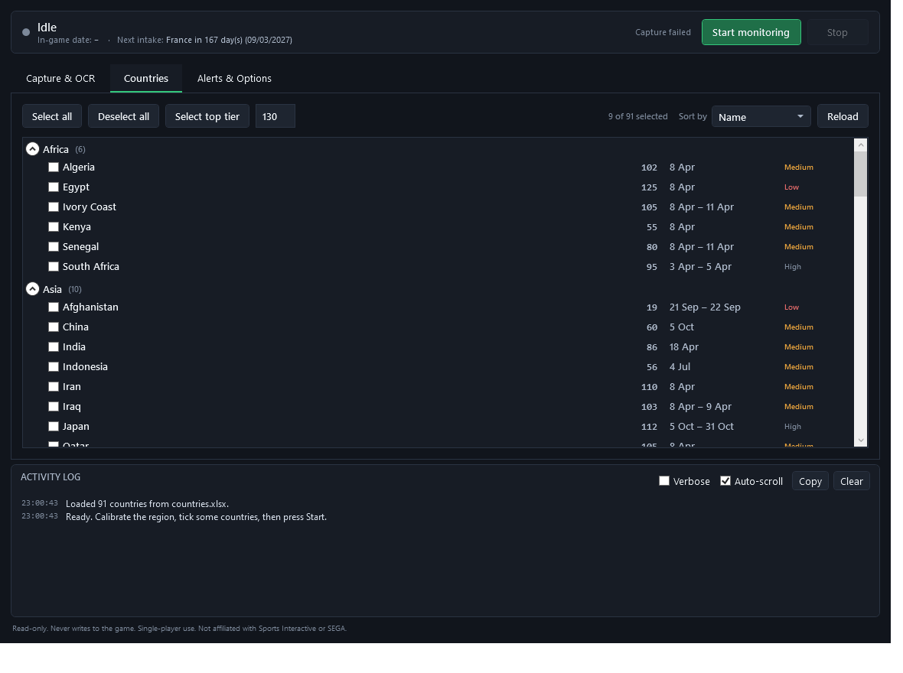

# FM Regen Notifier

[](https://github.com/sponsors/AlpayAydinguler)

A desktop companion for **Football Manager 2026** that watches the in-game clock
and tells you when a youth intake window opens.

FM26 removed the in-game Notes and Reminders feature, and since development has
ended at build 26.3.2 it is not coming back. That left no way to mark a date in
the game — including the one date most worth marking, youth intake day, when a
club's newgens are generated and every other club's are briefly visible and
cheap to approach.

This tool fills the gap from outside the game. It reads the date off the screen
once a second, compares it against a per-nation intake table, and alerts you when
a nation you care about opens its window. It never writes to the game, never
touches the save, and never injects anything into the process.



---

## Contents

- [What it does](#what-it-does)
- [Install](#install)
- [Using it](#using-it)
- [How the alerting actually works](#how-the-alerting-actually-works)
- [Privacy](#privacy)
- [Version compatibility](#version-compatibility)
- [Troubleshooting](#troubleshooting)
- [Building from source](#building-from-source)
- [Contributing](#contributing)
- [Licence and attribution](#licence-and-attribution)
- [Supporting the project](#supporting-the-project)

---

## What it does

- **Reads the in-game date** from a screen region you calibrate once, using
  Tesseract OCR with a preprocessing pipeline you can tune live.
- **Alerts when an intake window opens** for any of the 91 nations you have
  ticked — with a sound, a taskbar flash, and a tray notification.
- **Does not miss days.** FM's Continue button jumps to the next event rather
  than advancing one day at a time, so the intervening dates are never drawn at
  all. Alerts fire on interval crossing rather than date equality, which is the
  only approach that survives that. See [below](#how-the-alerting-actually-works).
- **Survives save-scumming.** Reloading to reroll an intake re-arms the alert
  instead of silently swallowing it.
- **Only watches while the game is running**, so it is not quietly OCR-ing your
  inbox.

---

## Install

### Requirements

- Windows 10 version 1809 or later (developed and tested on Windows 10 22H2)
- [.NET 10 Desktop Runtime (x64)](https://dotnet.microsoft.com/download/dotnet/10.0)
- Football Manager running in **windowed** or **borderless windowed** mode

### Steps

1. Download `FMRegenNotifier-win-x64.zip` from the
   [latest release](../../releases/latest).
2. Extract the **whole folder** somewhere convenient.
3. Run `FMRegenNotifier.exe`.

That is the entire setup. **You do not need to download language data
separately** — `tessdata/eng.traineddata` ships inside the zip.

> **Extract the whole folder, do not just copy the .exe.** Tesseract's native
> libraries live in an `x64\` subfolder beside the executable and the OCR engine
> will not start without them. This is also why there is no single-file build.

On first run the app creates:

| Path | What it is |
|---|---|
| `data/countries.xlsx` (beside the exe) | The editable intake table |
| `%APPDATA%\FMRegenNotifier\settings.json` | Your configuration |
| `%APPDATA%\FMRegenNotifier\state.json` | Last seen date and fired alerts |
| `%APPDATA%\FMRegenNotifier\logs\` | Rolling diagnostic log, 7 days |

---

## Using it

### 1. Calibrate the region

Start Football Manager in windowed or borderless mode, then click
**Select on screen…** and drag a box around the date in the game's top bar.

The defaults (`2035, 5` to `2180, 40`) suit a 2560×1440 display at 100% scaling.
If yours differs, either snip a new region or type the four numbers in; the live
cursor readout under the inputs makes manual entry straightforward.

**Leave a little room around the digits.** A capture that clips the top of a `7`
leaves something that genuinely *is* a `1`, and no amount of tuning recovers it.
The preview warns you when text touches the edge of the region.

### 2. Check the preview

The preview shows the **exact image handed to the OCR engine**, not the raw grab,
along with the text read and the date parsed from it. If the date under
**Parsed date** matches the game, you are done.

If not, see [Troubleshooting](#troubleshooting). Every tuning control re-reads the
screen immediately, so you can watch the effect of each change.

### 3. Pick your countries



Countries are grouped by continent with collapsible headers, sortable by name,
youth rating or intake date. **Select top tier** ticks everything at or above a
youth rating you choose (130 by default, which selects the nine elite newgen
nations).

The **Confidence** column is worth reading. The shipped dataset is FM24-era: rows
marked `Medium` are uncorroborated or carry a shared inactive-nation default
date, and `Low` rows are known to be stale or ambiguous. Correct them against
your own save — the table is a starting point, not gospel.

### 4. Start monitoring

Press **Start monitoring**. Coordinates, tuning and country selection lock while
it runs; press **Stop** to change them.

Minimise to the tray and the tooltip keeps showing the next intake and how many
in-game days away it is, so you can check without waiting for an alert.

---

## How the alerting actually works

This is the part worth understanding, because the obvious design is broken.

**FM's Continue button advances to the next event, not by one day.** Players
report jumping from 2 June to 8 June in a single click, and the skipped days are
never rendered on screen at all. So a tool that checks "is today's date equal to
an intake date" can silently never fire, and **sampling faster does not help** —
there is nothing to sample.

Instead the app remembers the last date it confirmed and asks a different
question: *did any armed trigger fall between where the clock was and where it is
now?* Holiday from January to June and every window you flew past is reported at
once, correctly, labelled with how late it is:

> England: intake window opened 5 days ago on 14/03/2026 — you are now at
> 19/03/2026. Still open until 31/03/2026.

Three more things fall out of that design:

- **A single misread cannot poison the state.** A new date must be seen twice in
  a row before it is committed, and a jump of more than 400 days is discarded as
  a misread rather than believed.
- **Reloading a save re-arms.** Save-scumming an intake is the main reason to
  want this tool, so a backwards jump un-fires the alerts it crossed. A real-time
  cooldown stops a tight reload loop from machine-gunning the same alert.
- **Only a clean read changes anything.** A failed capture, a menu covering the
  clock, or the game being closed are each distinct states, and none of them is
  treated as "the date did not change".

---

## Privacy

A screen scraper that runs unattended is a liability if it is not careful, so:

- Capture is **gated on Football Manager running and being the active window**,
  both on by default. Leave the app running overnight and it reads nothing.
- The rolling log records events and diagnostics, not the contents of your
  screen.
- Nothing is sent anywhere. There is no network code in this application.

The one deliberate exception: the tuning preview works with the game closed,
because otherwise you could not calibrate before launching FM. Preview text is
never written to the log file.

---

## Version compatibility

Nothing here is specific to FM26 beyond the default coordinates and the shipped
dates. Two seams make it portable:

**Re-calibrate the region.** Any Football Manager that draws a numeric date
anywhere on screen will work — FM27, FM28, or back to FM24 and FM23. Snip the new
location and the rest follows.

**Edit the spreadsheet.** `data/countries.xlsx` is the source of truth for
nations, ratings and intake windows. Change the dates for a new edition, add
nations the table is missing, or delete rows you do not care about, then press
**Reload** on the Countries tab. Delete the file entirely to regenerate the
built-in dataset.

| Column | Notes |
|---|---|
| `Code` | Unique. Selections are saved against this, so renaming a country does not clear your picks. |
| `Country`, `Continent` | Display name and grouping header. New continents create new groups. |
| `YouthRating` | 0–200. Drives sorting and **Select top tier**. |
| `StartMonth`, `StartDay` | When the window opens. This is what raises the alert. |
| `EndMonth`, `EndDay` | When it closes. Leave blank for a single-day window. |
| `Confidence` | `High`, `Medium` or `Low`. Shown in the dashboard. |
| `EnabledByDefault` | Ticked on a fresh install. |
| `Notes` | Free text, shown as a tooltip. |

If the game's date format differs, set it under **Date format** on the Capture
tab. Leave **Learn the format automatically** on and the app will work out
day-first versus month-first the first time it sees a date with a component
above 12.

---

## Troubleshooting

### A 7 is being read as a 1 (or as a slash)

The single most common OCR failure, and usually not an engine problem.

1. **Widen the region first.** If the capture clips the crossbar off the top of a
   `7`, what remains really is a `1`. The preview warns when ink touches the
   edge. This is the fix roughly half the time.
2. **Raise the binarization threshold** towards 160. Measured across synthetic
   dates at several text sizes, 160 read 6/6 correctly where the default 128 was
   erratic on thin text. The default is 128 because that is what was validated
   against the real game, but your skin or resolution may render lighter.
3. **Add a stroke-thickening pass.** When glyphs binarise down to a one-pixel
   skeleton, the crossbar of a `7` is the first thing to break up. One dilation
   pass restores it.
4. **Raise the upscale factor** if the region is small.

### The preview is blank or solid black

- The game is in **exclusive fullscreen**. Switch to borderless windowed —
  exclusive fullscreen cannot be captured this way.
- The coordinates are off-screen. Press **Reset** and re-snip.

### Nothing happens when I press Start

Check the Activity Log. Common causes:

- **No countries ticked** — the log says so explicitly.
- **"Football Manager is not running"** — the privacy gate is doing its job. The
  process name defaults to `fm`; change it under Alerts & Options if your
  installation differs.
- **The OCR engine is unavailable** — `tessdata/eng.traineddata` is missing,
  which usually means only the `.exe` was copied rather than the whole folder.

### The date is read but alerts never fire

Tick **Verbose** in the Activity Log to see every sample.

If you see `Rejected … confidence` on readings whose text looks **wrong**, the
image is too marginal — work through the 7-vs-1 steps above.

If you see it on readings whose text looks **correct**, that is a different
problem: Tesseract does not always report a useful confidence, and a perfectly
good reading can come back at zero. Lower **Minimum mean confidence** and
**Minimum per-character confidence** on the Alerts & Options tab, or set both to
0 to accept whatever the engine returns. A healthy setup reads around 85–99%, so
if yours sits far below that consistently, tune the image rather than the floor.

If the date advances but no alerts fire, check that the countries you expect are
ticked and that their windows are ahead of the current in-game date.

### "Football Manager is not running" while it is plainly running

The Activity Log names the process it searched for. The field accepts `fm`,
`fm.exe` or a full path — all are normalised — so if it still cannot find the
game, check the name against Task Manager's Details tab and update **Game
process name**.

### Alerts fire but I never notice them

Windows suppresses notifications under Focus Assist and over fullscreen apps; the
app warns in the log when it detects this. Sound and taskbar flash still work.
Use **Test alert** to check your configuration.

### The coordinates are wrong on a scaled display

The app declares per-monitor DPI awareness, so its coordinates are physical
pixels and should match. If you change your display scaling while it is running,
re-snip the region.

---

## Building from source

```bash
git clone https://github.com/AlpayAydinguler/FootballManagerRegenNotifier.git
cd FootballManagerRegenNotifier
dotnet test
dotnet run --project src/FootballManagerRegenNotifier.App
```

Requires the [.NET 10 SDK](https://dotnet.microsoft.com/download/dotnet/10.0).

| Project | Target | Purpose |
|---|---|---|
| `Core` | `net10.0` | Date state machine, trigger calendar, parser, catalog, settings. No UI, no Win32. |
| `Capture` | `net10.0-windows` | Screen capture, preprocessing, OCR, process gate. |
| `App` | `net10.0-windows` | WPF control centre. |
| `*.Tests` | matching | 126 tests, xUnit. |

`Core` targets plain `net10.0` deliberately: the correctness logic is where the
bugs would be expensive and invisible, so the compiler is used to keep screen and
UI code out of it, and its tests run in milliseconds with no desktop.

To regenerate the README screenshots:

```bash
dotnet run --project src/FootballManagerRegenNotifier.App -- --screenshot=docs/images/countries.png --tab=1
```

---

## Contributing

Issues and pull requests are welcome. The most useful contributions:

- **Corrected intake dates.** The shipped table is FM24-era and every row is
  flagged with a confidence level. If you have observed a real date in FM26,
  please send it — edit
  [`countries.seed.psv`](src/FootballManagerRegenNotifier.Core/Catalog/countries.seed.psv),
  which is plain text so changes are reviewable in a diff. Nigeria, DR Congo,
  U.A.E., Hong Kong, Malaysia and Singapore are missing entirely.
- **Defaults for other resolutions**, so first-run calibration is easier.
- **FM27 support** when it ships in November 2026.

Please keep `dotnet test` green, and add a test for anything touching
`DateTracker` — that is the part where a silent bug costs someone an intake.
Warnings are errors in CI.

---

## Licence and attribution

The **source code** is MIT licensed. See [LICENSE](LICENSE).

Two bundled components are not:

- The **youth intake dataset** is third-party factual data redistributed with
  attribution. See [data/LICENSE-DATA.md](data/LICENSE-DATA.md). The application
  runs without it.
- **`tessdata/eng.traineddata`** comes from the
  [Tesseract OCR project](https://github.com/tesseract-ocr/tessdata) under the
  Apache Licence 2.0. See [tessdata/README.md](tessdata/README.md).

Intake windows compiled from
[Passion4FM](https://www.passion4fm.com/football-manager-youth-intake-dates/);
youth ratings from
[FM Scout](https://www.fmscout.com/a-fm22-youth-ratings-all-nations.html).

**This is an unofficial tool.** It is read-only, intended for single-player use,
and is not affiliated with, endorsed by or sponsored by Sports Interactive, SEGA,
Passion4FM or FM Scout. Football Manager is a trademark of Sports Interactive and
SEGA.

---

## Supporting the project

FM Regen Notifier is free and always will be. If it saved you an intake you would
otherwise have sailed past, you can support it through
[**GitHub Sponsors**](https://github.com/sponsors/AlpayAydinguler) — the Sponsor
button at the top of this page.

Sponsorship is entirely optional and changes nothing about the tool: no features
are held back, and there is no paid tier.

Contributions of the other kind are just as welcome — corrected intake dates in
particular. See [Contributing](#contributing).
